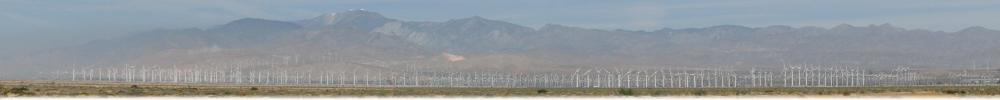

[Dr. Peter A. Gustafson](https://gustafson.github.io)

## General areas of interest

-   [Open and Collaborative Engineering](openengineering.html)
-   Composite Materials
-   Finite Element Modeling
-   Multiscale Methods for Structural Analysis
-   Machine Learning Applications in Structural Mechanics
-   Orthopaedic Biomechanics

## [Publications](publications.html)

## Media

<iframe width="640" height="360" src="https://www.youtube.com/embed/ojuQq0hNBNg" title="YouTube video player" frameborder="0" allow="accelerometer; autoplay; clipboard-write; encrypted-media; gyroscope; picture-in-picture" allowfullscreen></iframe>

Please visit [Dr. Gustafson' youtube channel](https://www.youtube.com/channel/UCRQxbJi1rK2RBXektLAbCJg)

### The vision of this laboratory is to have a positive impact on our world.

Having been empowered by education, hard work, good fortune, and
opportunity, we seek to empower the next generation of engineers.
Therefore, this lab provides educational opportunities for graduate
and undergraduate education in Mechanical and Aeronautical
Engineering.  The lab also strives to accommodate *life-long learning
at all levels* by fostering *open participation and
collaboration*

<!--img style="width: 100%;" alt="Wind Turbine Image" src="assets/images/turbine.jpg"-->
